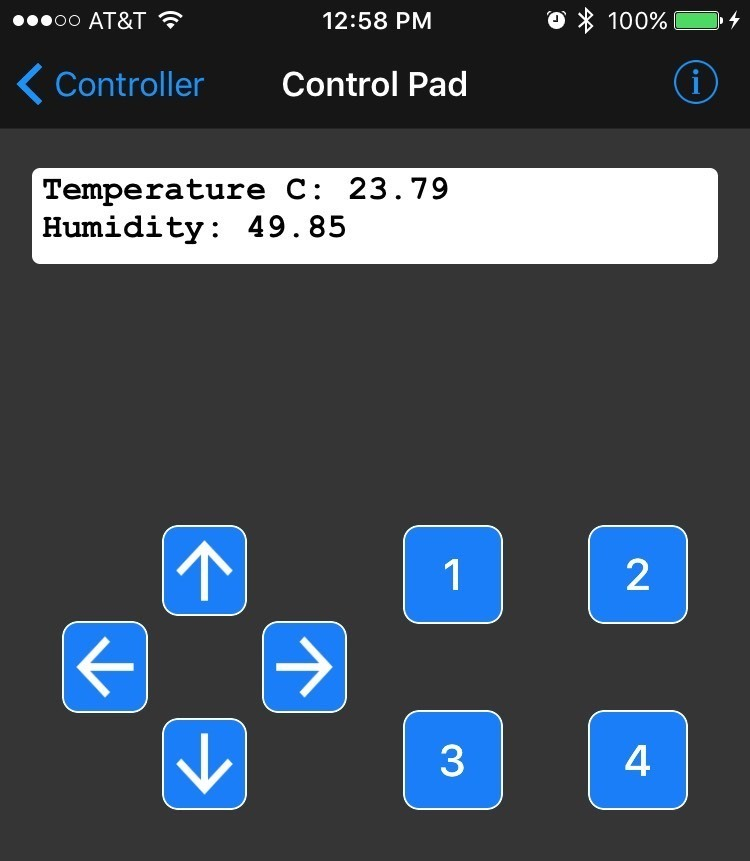
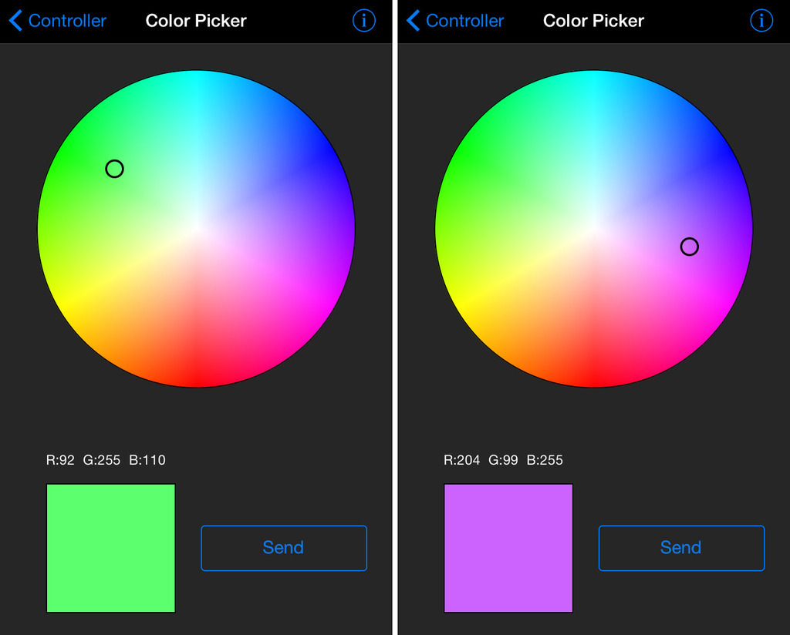

#### Set up CircuitPython Quick Start
https://learn.adafruit.com/introducing-the-adafruit-nrf52840-feather/circuitpython

##### Board Testing

1. Select the Board Target
2. Select the USB CDC Serial Port
3. Update the bootloader (nRF52832 Feather Only)
4. Run a Test Sketch
https://learn.adafruit.com/introducing-the-adafruit-nrf52840-feather/arduino-board-setup

##### CircuitPython for nRF53840 Download
https://circuitpython.org/board/feather_nrf52840_express/

##### BootLoader & Source Code
https://github.com/adafruit/Adafruit_nRF52_Bootloader/releases/tag/0.2.13

#### Libraries

##### Adafruit nRF52 Library

- dafruit-nrfutil is based on Nordic Semiconductor ASA's pc-nrfutil
- freeRTOS as operating system
- tinyusb as usb stack
- nrfx for peripherals driver
- littlefs for internal file system

https://github.com/adafruit/Adafruit_nRF52_Arduino/tree/master/libraries

##### Adafruit Sponsored Libraries and Drivers from CircuitPython 

https://github.com/adafruit/Adafruit_CircuitPython_Bundle/blob/master/docs/drivers.rst

#### Bluefruit App

##### Using your iOS or Android phone/tablet as a controller

A USB bootloader lets you quickly use it with the Arduino IDE or to install CircuitPython.

###### Sent data Format
Each Controller data packet sent is prefixed with single byte char “!” (0x21) followed by a single byte char initial for identification.
Sensor data values are encoded as floats of 4 byte length.  
Each packet ends with a single byte checksum for validation.

###### Controller Test
https://github.com/CollinCunningham/BLE_UART_Controller_Test/blob/master/BLE_UART_Controller_Test.ino

- Sensors
Quaternion, Accelerometer, Gyro, Magnetometer and Location (GPS)

- 8-button Control Pad

- Colour Picker

